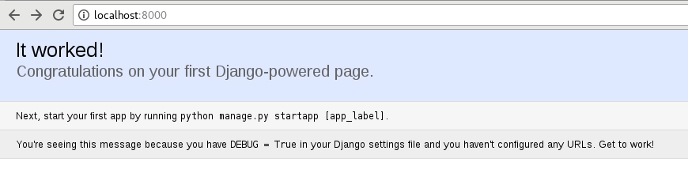
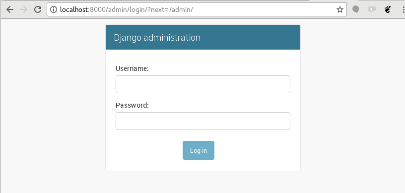

# Django

O framework web mais completo que você respeita

---

# Olar

@maribedran

[twitter.com/maribedran](https://twitter.com/maribedran)

[github.com/maribedran](https://github.com/maribedran)

[maribedran@gmail.com]()

@WPensar SA

---

## Conhecendo o Django

- Documentação oficial

    [docs.djangoproject.com](https://docs.djangoproject.com/)

- Tutoria do Django Girls

    [tutorial.djangogirls.org/pt/](https://tutorial.djangogirls.org/pt/)


---

## Internet


    https://google.com          [A Internet]          8.8.8.8

        +-----+                 HTTP Request           +----+
        |     |             ------------------>        |    |
        +-----+                                        |    |
        -------             <------------------        +----+
        -------                 HTTP Response

---

    "Uma aplicação web é um software que sabe processar uma requisição e retornar uma resposta para ela."


---

## O que tem em uma aplicação web?

```
                                Servidor
                  +----------------------------------+
                  |   Aplicações                     |
                  |    _   _                         |
                  |   |_| |_| ----->   +----------+  |
        Internet  |                    | Arquivos |  |
                  |    ______          |    BD    |  |
                  |   |Django| ---->   +----------+  |
                  |   +------+                       |
                  +----------------------------------+

```

---

## Tarefas básicas de uma aplicação

---

1. Receber uma requisição
    * WSGI conversa com o servidor
2. Decidir o que fazer com ela
    * Roteamento `urls.py`
3. Enviar uma resposta
    * Lógica de negócio implementada (seu código python)
    * Persistência (BD, arquivos locais, arquivos remotos)
    * Formatação da resposta pra quem vai consumi-la (json, html, css, js, xml, arquivo)

---

## O Django cuida de quase tudo pra você


```
             ===========  Django ==========
            ||                            ||
            \/                            \/
        +-----------------------------------------+
        |               |        |                |
        |               |        |                |
        |  Apresentação | Lógica |  Persistência  |
        |               |        |                |
        |               |        |                |
        +-----------------------------------------+
            /\              /\
            ||              ||
            ====== Você =====


```

---

## O padrão **M**odel**V**iew**T**emplate
A gente só mexe aqui

```
     +-----------------+
     |     urls.py     | Roteamento
     +-----------------+
             \/
     +-----------------+                    +-------------+
     |     views.py    | Delega tarefas ==> |  Templates  |
     +-----------------+                    +-------------+
             \/
     +-----------------+
     |     forms.py    | Validação e formatação de dados
     +-----------------+
             \/
     +-----------------+                     +----+
     |    models.py    |  Persistência   ==> | DB |
     +-----------------+                     +----+

```

---

## Começando um projeto

    $ pip install django==1.11           # Instalando o Django
    $ django-admin startproject project  # Inicializando o projeto
    $ cd project/
    $ python manage.py startapp cinema   # Criando um app

---

## Estrutura do projeto

     ▾ project/
       ▾ cinema/
         ▾ migrations/
             __init__.py
           __init__.py
           admin.py
           apps.py
           models.py
           tests.py
           views.py
       ▾ project/
         ▾ __pycache__/
           __init__.py
           settings.py
           urls.py
           wsgi.py
         manage.py*

---

## manage.py

```shell

    $ python manage.py --help

    Type 'manage.py help <subcommand>' for help on a specific subcommand.

    Available subcommands:

    [auth]
        changepassword
        createsuperuser

    [contenttypes]
        remove_stale_contenttypes

    [django]
        check
        compilemessages
        createcachetable
        dbshell
        diffsettings
        dumpdata
        flush
        inspectdb
        loaddata
        makemessages
        makemigrations
        migrate
        sendtestemail
        shell
        showmigrations
        sqlflush
        sqlmigrate
        sqlsequencereset
        squashmigrations
        startapp
        startproject
        test
        testserver

    [sessions]
        clearsessions

    [staticfiles]
        collectstatic
        findstatic
        runserver

```


---

## Migrando o banco

```
    $ python manage.py migrate
    Operations to perform:
      Apply all migrations: admin, auth, contenttypes, sessions
    Running migrations:
      Applying contenttypes.0001_initial... OK
      Applying auth.0001_initial... OK
      Applying admin.0001_initial... OK
      Applying admin.0002_logentry_remove_auto_add... OK
      Applying contenttypes.0002_remove_content_type_name... OK
      Applying auth.0002_alter_permission_name_max_length... OK
      Applying auth.0003_alter_user_email_max_length... OK
      Applying auth.0004_alter_user_username_opts... OK
      Applying auth.0005_alter_user_last_login_null... OK
      Applying auth.0006_require_contenttypes_0002... OK
      Applying auth.0007_alter_validators_add_error_messages... OK
      Applying auth.0008_alter_user_username_max_length... OK
      Applying sessions.0001_initial... OK
```

---

## Rodando o servidor


```
    $ python manage.py runserver
    Performing system checks...

    System check identified no issues (0 silenced).
    October 25, 2017 - 22:27:55
    Django version 1.11, using settings 'project.settings'
    Starting development server at http://127.0.0.1:8000/
    Quit the server with CONTROL-C.

```

---

## Pronto! É realmente só isso!





---

## Adicionando nossa app

`project/setting.py`

```

    # Application definition

    INSTALLED_APPS = [
        'django.contrib.admin',
        'django.contrib.auth',
        'django.contrib.contenttypes',
        'django.contrib.sessions',
        'django.contrib.messages',
        'django.contrib.staticfiles',
        'cinema',
    ]

```

---

## Tudo configurado!

Bora implementar a app!

---

## urls.py

Onde configuramos nossas rotas.


```
    # project/urls.py

    from django.conf.urls import url
    from django.contrib import admin

    urlpatterns = [
        url(r'^admin/', admin.site.urls),
    ]

```

---

## Retornando conteúdo

```
    # project/urls.py

    from django.conf.urls import url
    from django.contrib import admin
    from django.http import HttpResponse

    urlpatterns = [
        url(r'^admin/', admin.site.urls),
        url(r'^$', lambda request: HttpResponse('<h1>Olar!</h1>')),
    ]

```

---

>   Uma view é só uma função que recebe um objeto `HttpRequest` e retorna um `HttpResponse`.

```
    url(r'^$', lambda request: HttpResponse('<h1>Olar!</h1>'))

         /\               /\
         ||               ||
        rota             view
```

---

## Renderizando templates


```
texto = """
<h1>Classe de template: {{ template_class }}</h1>
<h1>Classe de Contexto: {{ context_class }}</h1>
"""
template = Template(texto)
contexto = {
    "template_class": str(Template),
    "context_class": str(Context)
}

urlpatterns = [
    url(r'^templates/$', lambda request: HttpResponse(
            template.render(Context(contexto)))),
]

```

---

## Incluindo urls da app

`projec/urls.py`

```
    url(r'^cinema', include('cinema.urls')),
```

---

## Fazendo todas as operações de CRUD

> **C**reate**R**etrieve**U**pdate**D**elete

---

`cinema/urls.py`

```
urlpatterns = [
    url(r'^/$',
        FilmeListView.as_view(), name='filme-list'),
    url(r'^/criar/$',
        FilmeCreateView.as_view(), name='filme-create'),
    url(r'^/(?P<pk>[0-9]+)/$',
        FilmeDetailView.as_view(), name='filme-detail'),
    url(r'^/(?P<pk>[0-9]+)/editar/$',
        FilmeUpdateView.as_view(), name='filme-update'),
    url(r'^/(?P<pk>[0-9]+)/remover/$',
        FilmeDeleteView.as_view(), name='filme-delete'),
]

```

---

`cinema/views.py`


```
from django.views.generic import (
    ListView, DetailView, CreateView,
    UpdateView, DeleteView
)
from django.urls import reverse_lazy
from cinema.models import Filme


class FilmeListView(ListView):
    model = Filme


class FilmeDetailView(DetailView):
    model = Filme

```

---

`cinema/views.py`

```
class FilmeCreateView(CreateView):
    model = Filme
    fields = ['titulo']
    success_url = reverse_lazy('filme-list')


class FilmeUpdateView(UpdateView):
    model = Filme
    fields = ['titulo']
    success_url = reverse_lazy('filme-list')


class FilmeDeleteView(DeleteView):
    model = Filme
    success_url = reverse_lazy('filme-list')
```

---

## Templates

> O Django espertamente encontra os templates pelo nome.

```
 ▾ cinema/
   ▸ migrations/
   ▾ templates/cinema/
       filme_confirm_delete.html
       filme_detail.html
       filme_form.html
       filme_list.html
     __init__.py
     admin.py
     apps.py
     models.py
     tests.py
     urls.py
     views.py
```

---

`cinema/templates/cinema/filme_list.html`

```
<h1>Filmes em cartaz</h1>
<ul>
	
		<li>{{ filme.titulo }}</li>
	
</ul>
```

`cinema/templates/cinema/filme_detail.html`

```
<h1>{{ filme.titulo }}</h1>

```

---

`cinema/templates/cinema/filme_form.html`

```

    Editar {{ object.titulo }}

    Novo Filme

<form action="" method="post">
    
    {{ form }}
    <input type="submit" value="Salvar" />
</form>
```

`cinema/templates/cinema/filme_delete.html`

```
<form action="" method="post">
    
	Deseja remover o filme?
    <input type="submit" value="Sim" />
</form>
```
