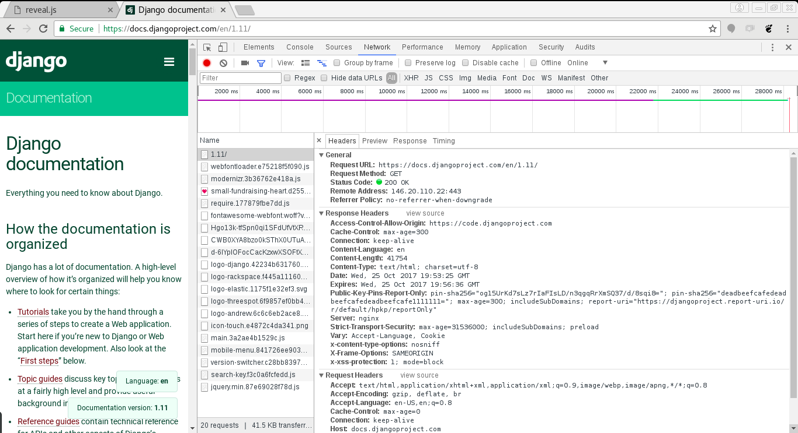

# Django

O framework web mais completo que você respeita

---

# Olar

@maribedran

[twitter.com/maribedran](https://twitter.com/maribedran)

[github.com/maribedran](https://github.com/maribedran)


---

## Conhecendo o Django

- Documentação oficial

    [docs.djangoproject.com](https://docs.djangoproject.com/)

- Tutoria do Django Girls

    [tutorial.djangogirls.org/pt/](https://tutorial.djangogirls.org/pt/)


---

## Internet


    https://google.com          [A Internet]          8.8.8.8

        +-----+                 HTTP Request           +----+
        |     |             ------------------>        |    |
        +-----+                                        |    |
        -------             <------------------        +----+
        -------                 HTTP Response

---

    "Uma aplicação web é um software que sabe processar uma requisição e retornar uma resposta para ela."





---

## O que tem em uma aplicação web?

```
                                Servidor
                  +----------------------------------+
                  |   Aplicações                     |
                  |    _   _                         |
                  |   |_| |_| ----->   +----------+  |
        Internet  |                    | Arquivos |  |
                  |    ______          |    BD    |  |
                  |   |Django| ---->   +----------+  |
                  |   +------+                       |
                  +----------------------------------+

```

---

## Tarefas básicas de uma aplicação

---

1. Receber uma requisição
    * WSGI conversa com o servidor
2. Decidir o que fazer com ela
    * Roteamento `urls.py`
3. Enviar uma resposta
    * Lógica de negócio implementada (seu código python)
    * Persistência (BD, arquivos locais, arquivos remotos)
    * Formatação da resposta pra quem vai consumi-la (json, html, css, js, xml, arquivo)

---

## O Django cuida de quase tudo pra você


```
             ===========  Django ==========
            ||                            ||
            \/                            \/
        +-----------------------------------------+
        |               |        |                |
        |               |        |                |
        |  Apresentação | Lógica |  Persistência  |
        |               |        |                |
        |               |        |                |
        +-----------------------------------------+
            /\              /\
            ||              ||
            ====== Você =====


```

---

## A gente só mexe aqui

```
     +-----------------+
     |     urls.py     | Roteamento
     +-----------------+
             \/
     +-----------------+                    +-------------+
     |     views.py    | Delega tarefas ==> |  Templates  |
     +-----------------+                    +-------------+
             \/
     +-----------------+
     |     forms.py    | Validação e formatação de dados
     +-----------------+
             \/
     +-----------------+                     +----+
     |    models.py    |  Persistência   ==> | DB |
     +-----------------+                     +----+

```
